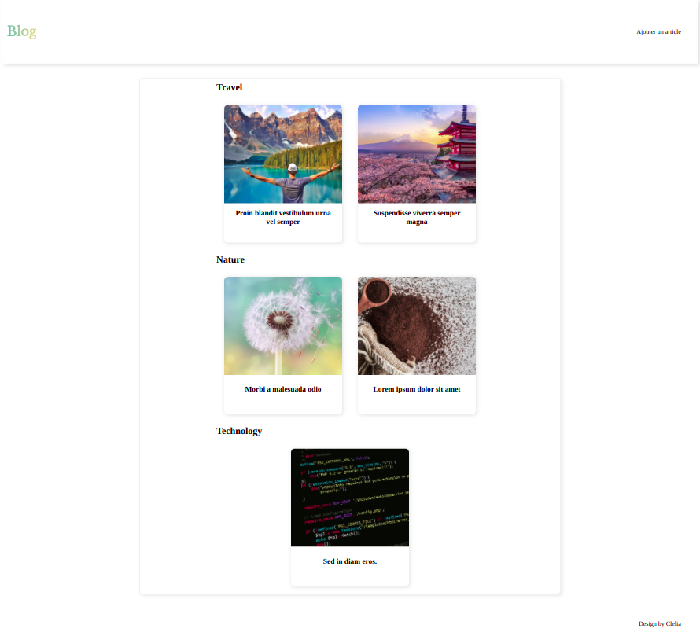

# Blog

I create a simple blog with PHP to practice.

## Table of contents

- [Screenshot](#screenshot)
- [My process](#my-process)
  - [Built with](#built-with)
- [Author](#author)

## Screenshot

